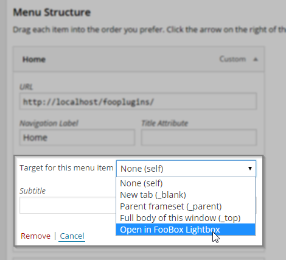

Add Target FooBox to Menu Items
=============

A WordPress plugin to enhance the "target" menu field to a dropdown of all standard options with the addition of a "FooBox" target as well.

## Installation and Use
* Install like a normal WordPress Plugin and activate
* Activate the plugin
* Go to Appearance > Menus
* Make sure in the "Screen Options" (top right) that you've enabled "Link Target"

* Expand the menu item you customize the target for
* Choose which target you want

## Targeting FooBox
* If you want to launch an Image or a Video from a Menu item, then you don't need this plugin, you just need to add a custom link to your image, and enable "CSS Classes" and add "foobox" as the custom CSS class.
* If you want to launch a [Hidden Gallery](http://docs.fooplugins.com/foobox/hidden-gallery/) from a menu link, you don't need this plugin either. Just add your hidden gallery somewhere on the page, and add a custom link to that gallery's ID name, and add the custom CSS class "footrigger". See the link I provided for full details.
* **BUT! If you want to launch an external website**, or any other html content in an iFrame in FooBox... THAT'S when you'll need this plugin. Just make sure you ALSO select "CSS Classes" and add the custom class "foobox" in addition to selecting the target. [More info on the iFrame method here.](http://docs.fooplugins.com/foobox/iframes/).

## Planned Updates
* Will be adding a "Custom target" field for other plugins that use custom targets like FooBox does.
* Will be adding a custom target option for the Post/Page Editor insert link field as well.

## Contribute
Feel free to make pull requests or submit issues. I'll do my best to reply soon.

Feel free to find me anywhere else:

[![alt text][1.1]][1] [![alt text][2.1]][2] [![alt text][3.1]][3] [![alt text][6.1]][6]

[1.1]: http://i.imgur.com/tXSoThF.png (twitter icon with padding)
[2.1]: http://i.imgur.com/P3YfQoD.png (facebook icon with padding)
[3.1]: http://i.imgur.com/yCsTjba.png (google plus icon with padding)
[6.1]: http://i.imgur.com/0o48UoR.png (github icon with padding)

[1]: http://www.twitter.com/learnwithmattc
[2]: http://www.facebook.com/mathetos
[3]: https://plus.google.com/+MattCromwell
[6]: http://www.github.com/mathetos
